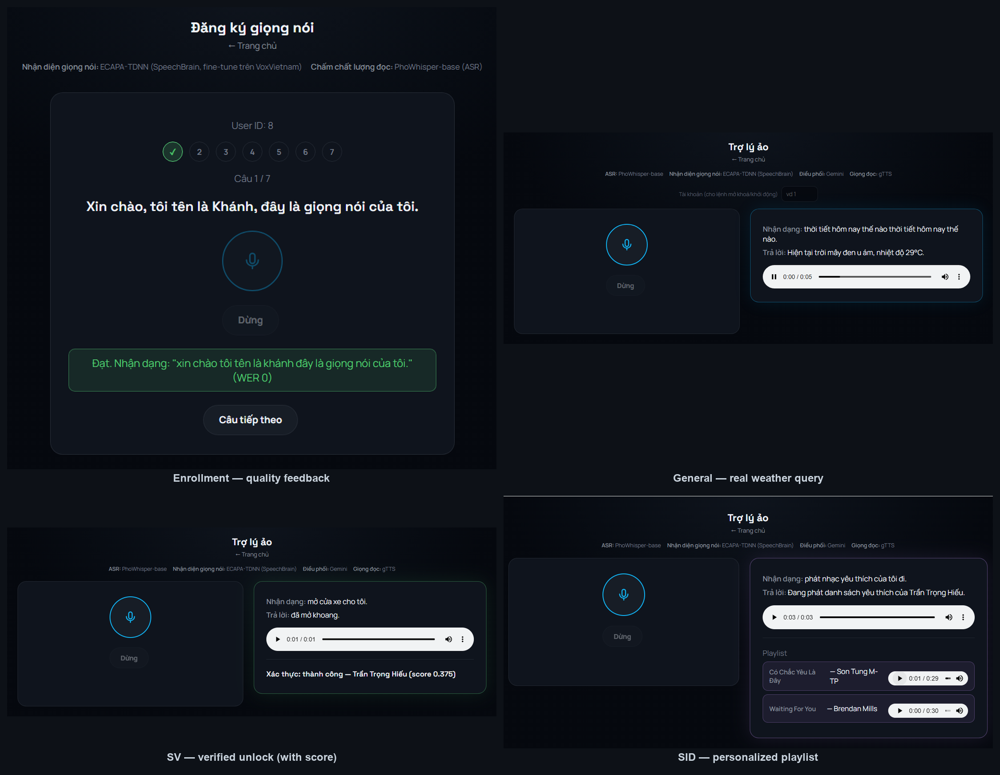
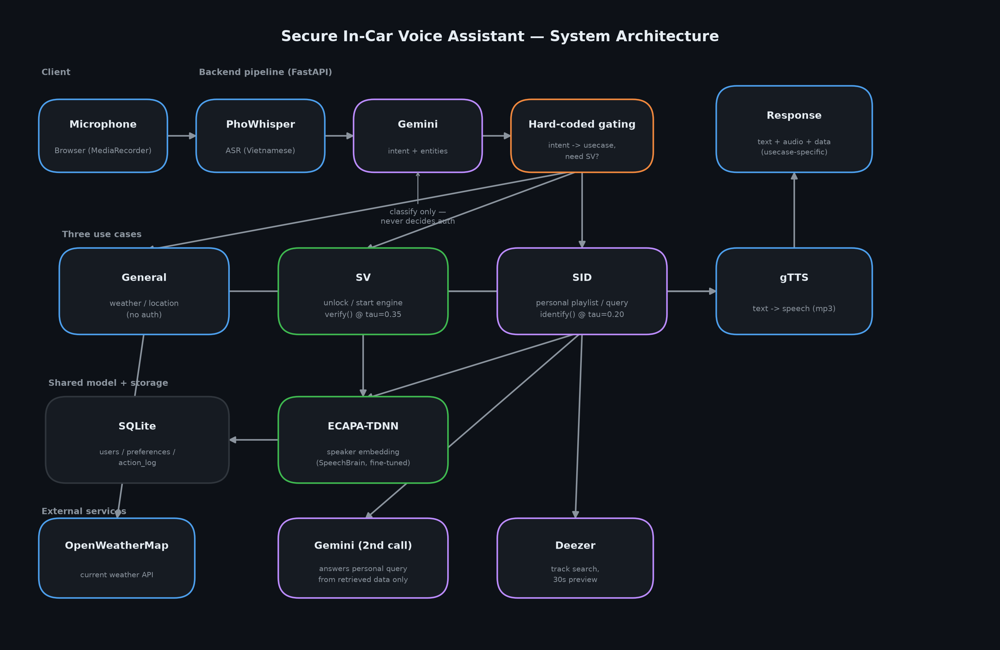

# Secure Virtual Assistant with Speaker Recognition

Trợ lý ảo xe thông minh tích hợp **Speaker Verification (SV)** cho lệnh nhạy cảm (mở khoang, khởi động xe) và **Speaker Identification (SID)** để cá nhân hoá trải nghiệm (phát nhạc yêu thích, trả lời thông tin cá nhân đã đăng ký) — dựa trên model ECAPA-TDNN tự fine-tune trên bộ dữ liệu VoxVietnam.

**🚗 Demo trực tiếp:** https://thales1020-secure-virtual-assistant.hf.space

| Trang | Chức năng |
|---|---|
| [`/enroll.html`](https://thales1020-secure-virtual-assistant.hf.space/enroll.html) | Đăng ký giọng nói (đọc 7 câu mẫu, có kiểm tra chất lượng) |
| [`/chat.html`](https://thales1020-secure-virtual-assistant.hf.space/chat.html) | Nói lệnh — hệ thống tự nhận diện giọng, không cần khai báo danh tính |

## Demo thật



*Enrollment (kiểm tra chất lượng qua WER), hỏi thời tiết thật (OpenWeatherMap), xác thực mở khoang thành công (ECAPA-TDNN, score thật), phát playlist cá nhân hoá thật (Deezer).*

## Kiến trúc hệ thống



Nguyên tắc cốt lõi: **LLM (Gemini) chỉ phân loại ý định**, không bao giờ tự quyết định có cần xác thực giọng nói hay không — việc gate SV/SID nằm cứng trong code Python (`webapp/backend/gating.py`). Gemini chỉ được phép dùng dữ liệu đã truy vấn thật (sau khi `identify()` xác nhận danh tính) để soạn câu trả lời cho truy vấn cá nhân, không tự suy đoán danh tính.

## Phân công 2 module

Đề bài (`Secure-Virtual-Assistant-with-Speaker-Recognition.pdf`) được chia làm 2 phần độc lập:

- **Module A — huấn luyện model** (`kaggle_upload/`, `model/`): fine-tune ECAPA-TDNN trên VoxVietnam (Kaggle), đánh giá EER/AUC/minDCF, bàn giao `speaker_model.py` + checkpoint cho Module B. Xem [`kaggle_upload/README.md`](kaggle_upload/README.md).
- **Module B — web app** (`webapp/`): pipeline ASR → Gemini orchestration → gating cứng → 3 usecase (General/SV/SID) → TTS, giao diện web, deploy lên Hugging Face Spaces. Xem [`webapp/spec_ModuleB_web_app.md`](webapp/spec_ModuleB_web_app.md), [`webapp/IMPLEMENTATION_PLAN.md`](webapp/IMPLEMENTATION_PLAN.md), [`webapp/DEPLOY.md`](webapp/DEPLOY.md).

## Cấu trúc repo

```
.
├── Secure-Virtual-Assistant-with-Speaker-Recognition.pdf   # đề bài gốc
├── kaggle_upload/            # Module A — pipeline train/eval trên Kaggle
│   ├── configs/               # hyperparameter (ecapa_voxvietnam.yaml)
│   ├── data/                  # chuẩn bị dataset (streaming VoxVietnam)
│   └── src/                   # model, train, evaluate, export
├── model/moduleA_artifacts_final/   # artefact bàn giao: speaker_model.py, metrics, enrollment_sentences.md
├── webapp/                   # Module B — web app
│   ├── backend/                # FastAPI: ASR, orchestrator, gating, usecases, TTS, DB
│   ├── frontend/                # HTML/CSS/JS thuần (dark car-dashboard UI)
│   ├── Dockerfile, app.py, requirements.txt   # 2 phương án deploy (Docker / HF Space Gradio SDK)
│   └── *.md                    # spec, kế hoạch implement, hướng dẫn deploy
├── scripts/deploy_hf_space.py   # script CI/CD đồng bộ webapp/ lên HF Space
└── .github/workflows/           # GitHub Actions: tự deploy khi push
```

## Tech stack

| Thành phần | Công nghệ |
|---|---|
| Speaker recognition | ECAPA-TDNN (SpeechBrain, fine-tune trên VoxVietnam) |
| ASR | PhoWhisper-base |
| Orchestration | Gemini (`gemini-3.1-flash-lite`) — chỉ classify, không quyết định auth |
| TTS | gTTS |
| Backend | FastAPI (Python) |
| Frontend | HTML/CSS/JS thuần, không framework |
| Database | SQLite (SQLAlchemy) |
| Thời tiết / Nhạc | OpenWeatherMap / Deezer API |
| Deploy | Hugging Face Spaces (Gradio SDK runtime, ZeroGPU) + GitHub Actions CI/CD |

## Chạy local

```bash
cd webapp
python -m venv .venv && .venv/Scripts/activate   # Windows
pip install -r backend/requirements.txt
# tạo .env ở repo root với GEMINI_API_KEY, OPENWEATHER_KEY
uvicorn backend.main:app --reload
```

Chi tiết đầy đủ (biến môi trường, threshold, giới hạn đã biết): xem [`webapp/spec_ModuleB_web_app.md`](webapp/spec_ModuleB_web_app.md) và [`model/moduleA_artifacts_final/README_ban_giao.md`](model/moduleA_artifacts_final/README_ban_giao.md).
